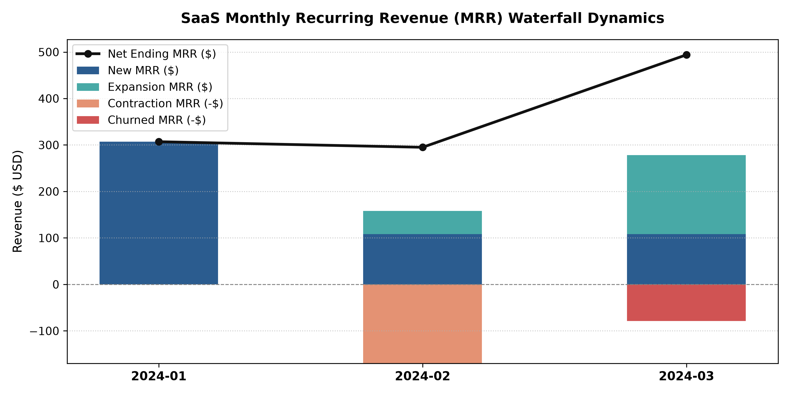

# SaaS Recurring Revenue (MRR) & Churn Forensics Engine

An advanced SQL analytics pipeline designed to evaluate SaaS financial metrics, track customer churn, and construct Monthly Recurring Revenue (MRR) waterfalls.

## MRR Waterfall Breakdown

## Business Metrics Computed
- **MRR Waterfall Movements:** Distinguishes New, Expansion (upgrades), Contraction (downgrades), and Churned revenue.
- **Logo Churn vs. Revenue Churn:** Quantifies account loss percentages against bottom-line dollar attrition.
- **Net Ending MRR Trajectory:** Tracks net cash flow across subscription cohorts.

## Technical Implementation
- **SQL Mechanics:** Multi-level Common Table Expressions (CTEs), `LAG()` Window Functions across partitioned customer accounts, and conditional `CASE WHEN` aggregation.
- **Database:** `sqlite3` relational schema enforcing foreign keys and event logging.
- **Visualization:** `matplotlib` multi-layer waterfall charts and net trend trajectories.

## How to Run
1. `python setup_database.py` - Initialize schema and historical subscription events.
2. `python run_mrr_analysis.py` - Execute SQL CTEs to generate console waterfall summaries.
3. `python visualize_mrr.py` - Render and export the executive MRR waterfall visualization.
